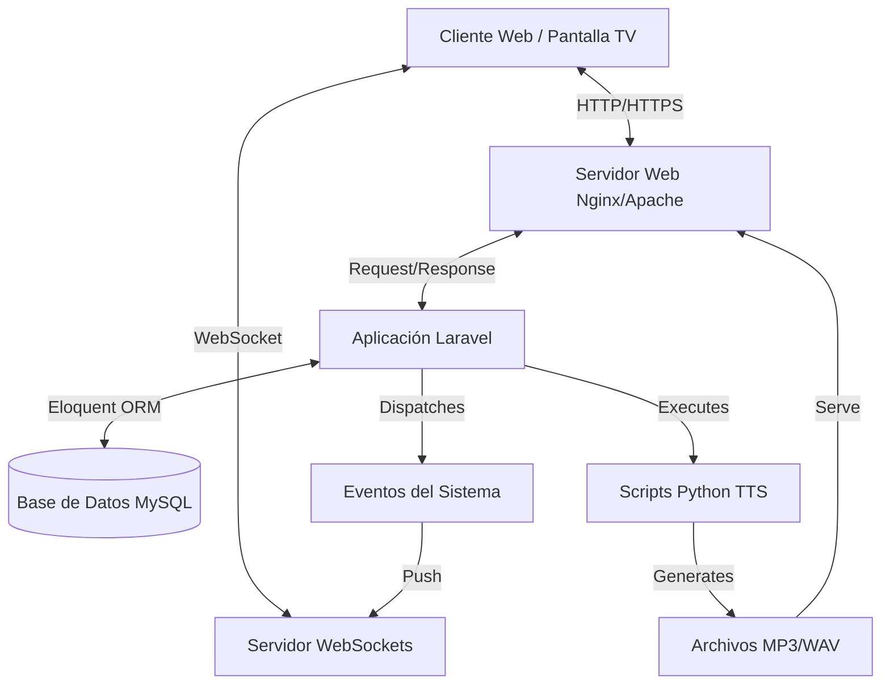

# INNOVACIÓN Y DESARROLLO - HOSPITAL UNIVERSITARIO DEL VALLE
## SISTEMA DE GESTIÓN DE TURNOS (TURNERO HUV)

---

# DOCUMENTACIÓN TÉCNICA

### TABLA DE CONTENIDOS

1. [Arquitectura del Sistema](#1-arquitectura-del-sistema)
    - [Estilo Arquitectónico](#11-estilo-arquitectónico)
    - [Diagrama de Componentes](#12-diagrama-de-componentes)
2. [Stack Tecnológico](#2-stack-tecnológico)
    - [Backend (Laravel)](#21-backend-laravel)
    - [Frontend (Blade, Alpine.js, Tailwind)](#22-frontend)
    - [Base de Datos](#23-base-de-datos)
    - [Tiempo Real (WebSockets)](#24-tiempo-real)
3. [Modelo de Datos (Schema)](#3-modelo-de-datos-schema)
    - [Diagrama Entidad-Relación](#31-der)
    - [Diccionario de Datos Detallado](#32-diccionario-de-datos)
4. [Controladores y Lógica de Negocio](#4-controladores-y-lógica-de-negocio)
    - [Gestión de Turnos (Flow)](#41-gestión-de-turnos)
    - [Sistema de Configuración de TV](#42-sistema-de-configuración-de-tv)
    - [Generación de Estadísticas](#43-generación-de-estadísticas)
5. [APIs y Servicios Web](#5-apis-y-servicios-web)
    - [Endpoints Internos](#51-endpoints-internos)
    - [Consumo de Datos](#52-consumo-de-datos)
6. [Sistema de Generación de Voz (TTS)](#6-sistema-de-generación-de-voz-tts)
7. [Seguridad Implementada](#7-seguridad-implementada)
8. [Despliegue e Instalación](#8-despliegue-e-instalación)

---

## 1. ARQUITECTURA DEL SISTEMA

### 1.1. Estilo Arquitectónico

El **Turnero HUV** sigue el patrón de arquitectura **MVC (Modelo-Vista-Controlador)** robustecido, propio del framework Laravel. Este patrón separa la lógica de negocio, la interfaz de usuario y la interacción de datos, permitiendo un mantenimiento escalable y modular.

-   **Modelos (M):** Representan las tablas de la base de datos y sus relaciones (Eloquent ORM). Encapsulan la lógica de acceso a datos.
-   **Vistas (V):** Renderizan la interfaz de usuario utilizando el motor de plantillas **Blade**. Se enriquecen con interactividad mediante **Alpine.js** y estilos con **Tailwind CSS**.
-   **Controladores (C):** Orquestan el flujo de información entre el usuario, los modelos y las vistas. Manejan la validación de entrada y la lógica de negocio principal.

Adicionalmente, el sistema implementa una arquitectura **Orientada a Eventos (Event-Driven)** para las funcionalidades de tiempo real:
-   Eventos de Laravel (`TurnoLlamado`, `TurnoCreado`) disparan notificaciones a través de canales de Broadcasting.

### 1.2. Diagrama de Componentes Lógicos

---

## 2. STACK TECNOLÓGICO

### 2.1. Backend (Laravel 12.0)
El núcleo del sistema.
-   **Routing:** Rutas web definidas en `routes/web.php` con middlewares de autenticación y roles.
-   **Middleware:** `auth`, `admin.role`, `asesor.role` protegen el acceso según privilegios.
-   **Eloquent ORM:** Manejo de base de datos orientado a objetos.
-   **Service Container:** Inyección de dependencias para servicios como `VoiceService` o `ReportesService`.

### 2.2. Frontend
Diseño moderno y ligero sin la pesadez de frameworks SPA completos para garantizar rapidez en equipos hospitalarios modestos.
-   **Tailwind CSS 4.0:** Framework de utilidades CSS para diseño responsivo y customización rápida.
-   **Alpine.js 3.14:** Framework JavaScript ligero para manejar estado reactivo en el DOM (modales, actualizaciones de DOM dinámicas) sin necesidad de compilación pesada.
-   **Blade:** Motor de plantillas servidor. Permite herencia de layouts (`layouts.app`, `layouts.guest`).

### 2.3. Base de Datos
Estructura relacional normalizada.
-   Soporte para MySQL/MariaDB.
-   Uso intensivo de índices en columnas de búsqueda frecuente (`estado`, `created_at`, `user_id`) para optimizar reportes de millones de registros.

### 2.4. Tiempo Real
-   **Laravel Echo:** Cliente JS para suscripción a canales.
-   **Pusher / Reverb:** Backend de WebSocket.
-   **Canales Privados:** Para dashboards de asesores.
-   **Canales Públicos:** Para pantallas de TV (`turnos-channel`).

---

## 3. MODELO DE DATOS (SCHEMA)

A continuación se detalla la estructura de la base de datos, vital para entender el almacenamiento de información.

### 3.1. Tablas Principales

#### `users` (Usuarios del Sistema)
Almacena la información de autenticación y perfil.
-   `id`: Primary Key.
-   `name`: Nombre completo.
-   `email`: Correo corporativo (Login).
-   `password`: Hash Bcrypt.
-   `role`: Enum (`admin`, `asesor`, `tv`). Define permisos.
-   `estado_asesor`: Estado actual (`disponible`, `ocupado`, `pausa`).
-   `caja_id`: (FK) Caja física asignada actualmente (nullable).

#### `cajas` (Puntos de Atención)
Representa las taquillas físicas o consultorios.
-   `id`: Primary Key.
-   `nombre`: Identificador (ej. "Ventanilla 1", "Consultorio 104").
-   `tipo`: General o Especializada.
-   `estado`: Activa/Inactiva.

#### `servicios` (Tipos de Trámite)
Categorización de las atenciones.
-   `id`: Primary Key.
-   `nombre`: Nombre del servicio (ej. "Farmacia", "Citas Médicas").
-   `codigo`: Prefijo para el turno (ej. "FAR", "MED").
-   `descripcion`: Detalle opcional.
-   `requiere_priorizacion`: Boolean.

#### `turnos` (Núcleo Transaccional)
Registro de cada turno generado. **Tabla de alto volumen**.
-   `id`: Primary Key.
-   `codigo`: Código completo (ej. "MED-001").
-   `consecutivo`: Número secuencial diario.
-   `servicio_id`: (FK) Servicio solicitado.
-   `user_id`: (FK) Usuario (Asesor) que atiende (nullable hasta ser llamado).
-   `caja_id`: (FK) Caja donde se atiende.
-   `estado`: Enum (`espera`, `llamado`, `en_atencion`, `finalizado`, `cancelado`).
-   `prioridad`: Integer (Alta, Media, Baja).
-   `nombre_paciente`: Dato opcional del paciente.
-   `documento_paciente`: Cédula (para trazabilidad).
-   `created_at`: Fecha hora llegada (Ticket).
-   `started_at`: Fecha hora inicio atención.
-   `ended_at`: Fecha hora fin atención.
-   `duracion_atencion`: Calculado en segundos.

#### `turno_historial` (Auditoría)
Traza cada cambio de estado de un turno.
-   `id`: PK.
-   `turno_id`: (FK).
-   `estado_anterior`: Estado previo.
-   `estado_nuevo`: Nuevo estado.
-   `user_id`: Usuario que realizó la acción.
-   `timestamp`: Momento exacto.

#### `multimedia` (Contenido TV)
Gestión de videos e imágenes para la pantalla pública.
-   `id`: PK.
-   `tipo`: `imagen` o `video`.
-   `url`: Path al archivo en storage.
-   `orden`: Secuencia de reproducción.
-   `activo`: Boolean.
-   `duracion`: Segundos (para imágenes).

#### `tv_configs` (Configuración Visual)
Personalización de la apariencia del display.
-   `id`: PK.
-   `titulo_institucional`: Texto del header.
-   `mensaje_scrolling`: Texto marquesina inferior.
-   `color_principal`: Hex code.
-   `logo_url`: Path al logo.

---

## 4. CONTROLADORES Y LÓGICA DE NEGOCIO

### 4.1. `TurnoController`
Controlador central para la operación diaria.
-   `store()`: Crea un nuevo turno. Imprime el ticket (o genera vista de impresión).
-   `callNext()`: Lógica compleja.
    1.  Busca turno en estado `espera` más antiguo.
    2.  Prioriza por `prioridad` del servicio o paciente.
    3.  Asigna `user_id` (asesor actual) y `caja_id`.
    4.  Cambia estado a `llamado`.
    5.  Dispara evento `TurnoLlamado`.
    6.  Genera audio TTS si no existe.
-   `startAttention()`: Cambia de `llamado` a `en_atencion`. Marca `started_at`.
-   `finish()`: Cambia a `finalizado`. Calcula `duracion_atencion`.

### 4.2. `AdminController` y `GraficosController`
Gestión y Business Intelligence.
-   Generan consultas agregadas (`GROUP BY`) para dashboards.
-   Optimizados para no bloquear la base de datos con consultas pesadas (usan rangos de fechas).
-   `ReportesController` utiliza librerías de exportación para generar Excel/PDF.

### 4.3. `VoiceController`
Puente entre PHP y Python.
-   Recibe solicitud de texto.
-   Verifica si el archivo de audio ya existe (hash del texto).
-   Si no, invoca script Python (`scripts/generate_voice_simple.py` o similar) mediante `exec()` o `Process`.
-   Retorna URL del audio para reproducción en frontend.

---

## 5. APIS Y SERVICIOS WEB

El sistema expone endpoints RESTful internos consumidos por el frontend (AJAX/Fetch).

### 5.1. Endpoints de Datos
-   `GET /api/turnos-hoy`: Retorna lista JSON de turnos del día para el dashboard.
-   `GET /api/admin/graficos/*`: Serie de endpoints para alimentar Chart.js en el panel administrativo.
-   `POST /api/voice/generate`: Solicita generación de audio bajo demanda.

### 5.2. Mecanismo de Consumo
Las vistas utilizan `fetch()` o `axios` para consultar estos endpoints. Se protegen mediante middleware `auth` para asegurar que solo usuarios logueados accedan a la data sensible.

---

## 6. SISTEMA DE GENERACIÓN DE VOZ (TTS)

Innovación clave del proyecto.

### Componentes
1.  **Piper TTS:** Motor neuronal de síntesis de voz open-source.
    -   Ubicación: `tools/piper/`
    -   Ventaja: No requiere cloud, 0 costo, latencia < 200ms.
2.  **Interfaz Python:** Scripts en `scripts/` actúan como wrappers.
    -   Reciben texto por argumentos de línea de comandos.
    -   Normalizan texto (números a letras, abreviaturas).
    -   Invocan binario de Piper.
3.  **Gestión de Caché:** Los audios se guardan en `public/audio/`. El nombre del archivo es un hash del texto para evitar regenerar audios comunes ("Turno A uno", "Turno A dos").

---

## 7. SEGURIDAD IMPLEMENTADA

### 7.1. Protección CSRF
Todos los formularios HTML incluyen token `@csrf`. Las llamadas AJAX incluyen el token en headers `X-CSRF-TOKEN`.

### 7.2. Sanitización
-   Validación estricta de Request inputs (`$request->validate()`).
-   Uso de Eloquent para prevenir Inyección SQL.
-   Escapado de output en Blade `{{ $var }}` para prevenir XSS.

### 7.3. Control de Acceso (RBAC)
Sistema de Roles y Permisos personalizado (no packages externos pesados). Middleware `CheckRole` verifica columna `role` en base de datos antes de permitir acceso a rutas `/admin/*`.

---

## 8. DESPLIEGUE E INSTALACIÓN

Pasos técnicos para puesta en marcha en servidor limpio.

1.  **Clonar Repositorio:** `git clone ...`
2.  **Instalar Dependencias PHP:** `composer install --no-dev --optimize-autoloader`
3.  **Instalar Dependencias JS:** `npm install && npm run build`
4.  **Configurar Entorno:** `cp .env.example .env` y editar credenciales.
5.  **Generar Key:** `php artisan key:generate`
6.  **Migrar BD:** `php artisan migrate --seed` (Seed crea usuario admin y datos base).
7.  **Symlink Storage:** `php artisan storage:link` (Crucial para ver imágenes/audio).
8.  **Permisos:** `chmod -R 775 storage bootstrap/cache`.
9.  **Configurar Supervisor:** Para mantener corriendo `php artisan queue:work` y WebSockets si aplica.

---

**FIN DE LA DOCUMENTACIÓN TÉCNICA**
**INNOVACIÓN Y DESARROLLO - HUV**
